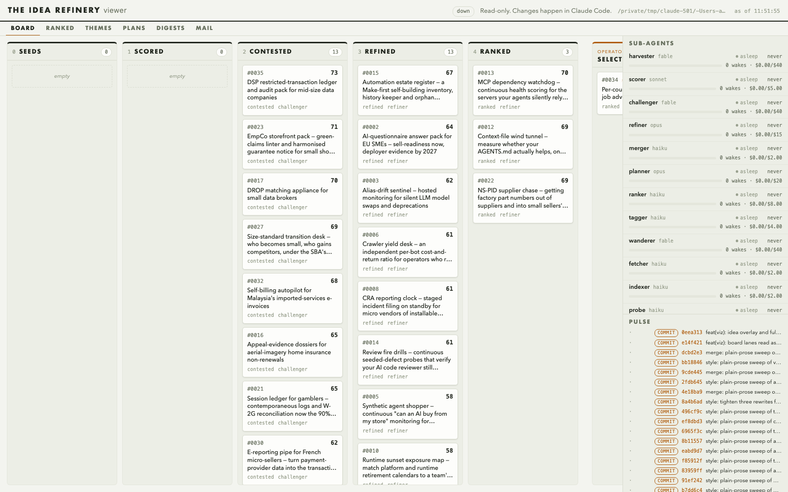
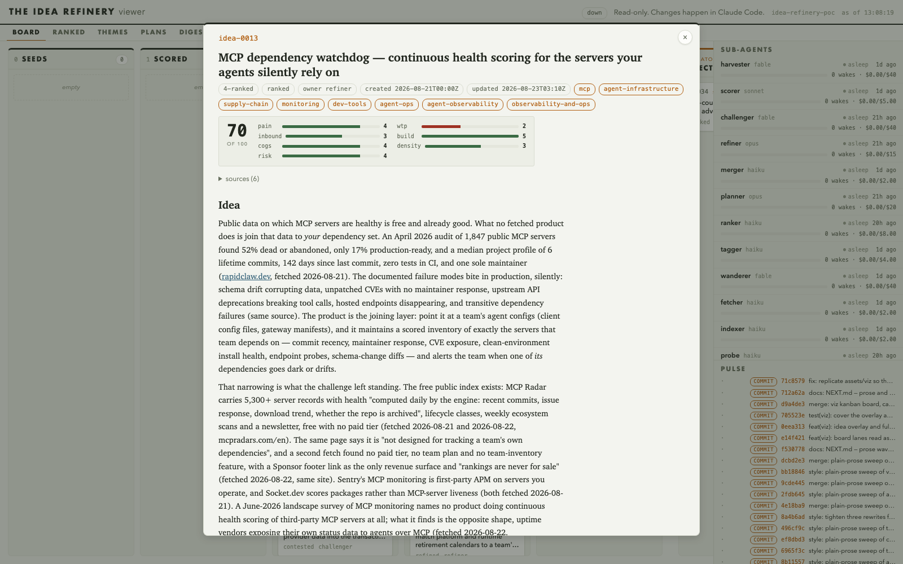

# idea-refinery-poc

The Idea Refinery is a set of Claude Code sub-agents running as background loops. Each
loop wakes on an interval, does one narrow job on the funnel (seed, score, challenge,
refine, plan, rank), commits its work, and sleeps. The sub-agents coordinate through
file-based mail, every idea is a markdown document in this repository, git is the audit
log, and a human overseer session steers and has the final word.

## Operator skills

Five levers, all pulled from an interactive Claude Code session except the last, which
is the script the cycle skill wraps.

- **`/refinery-run [up|status|down] [cruise]`** starts, inspects, or stops the
  continuous refinery. `up` opens one tmux window per loop agent and reports each
  agent's first status; `status` prints one line per agent with window state, last
  wake, today's wakes and spend, and error-log size; `down` writes `STOP`, waits for
  every loop to exit on its own, then removes the session. Reach for it when you want
  the refinery working unattended, want to know what it is doing, or want it stopped
  safely.
- **`/refinery-cycle [-n N] [agents...]`** runs one serial pass of the funnel with no
  sleeps between wakes, then summarises what moved: new commits, bucket counts, and
  the top of `RANKED.md`. Reach for it when you want movement now rather than waiting
  out the loop intervals. It refuses to run while the continuous refinery is up.
- **`/idea-inject <prose or idea-NNNN>`** puts one idea through the whole funnel. Give
  it a prose brief and it seeds the idea via an overseer directive to the harvester,
  charter gates applied; give it an existing idea's id and it carries that idea
  forward from wherever it stands. It cycles until the idea graduates, is killed, or
  stalls, then reports the journey: every comment, each score change, and the final
  bucket.
- **`/idea-digest`** reads every idea document and writes `digests/DIGEST_<date>.md`:
  each idea's stage and score, its consumer offering in plain customer language, and
  the shortest honest statement of what realising it still needs. Reach for it when
  you want to scan the whole corpus without opening every file.
- **`npm run -s cycle -- [-n max_cycles] [agent ...]`** is the direct form of the
  funnel pass, no session needed. It wakes each agent once per cycle in funnel order
  and prints a progress line per cycle, stopping early once a cycle changes nothing.
  Reach for it from a plain terminal or a script when you don't need the summary the
  skill adds.

## Two prompts to paste

Run it out of the box. Paste this into the Claude Code TUI:

```
Check the refinery is ready to run: .env carries a VOYAGE_API_KEY, npm install is
done, npm run -s check is green, and one probe wake completes cleanly. Then start
the refinery with /refinery-run, report the per-agent status lines, and keep watch.
Tell me when something notable happens: new seeds, kills, graduations, or a change
at the top of RANKED.md. When I say stop, bring the loops down cleanly with
/refinery-run down and give me a closing summary of what moved while it ran.
```

Elaborate one idea. Paste this into the Claude Code TUI, replacing the placeholder:

```
I have an idea: <YOUR IDEA — two or three sentences: who it is for, what they get,
why now>. Run /idea-inject with that brief and report the idea's full journey: the
seed it became, its score with the breakdown, the challenge and what survived it,
and where it ended up.
```

## Prerequisites

- Node 24 or later.
- The Claude Code CLI, logged in. The refinery pins a CLI version in
  `caps.json` (`cliVersion`); the probe re-verifies the pin after a CLI
  upgrade.
- tmux, for the continuous loops.
- git.
- A Voyage AI key. Copy `.env.example` to `.env` and fill in `VOYAGE_API_KEY`.
  `src/embed.mjs` uses it to embed idea pitches for the tagger's themes and for
  the retrieval index. The key never leaves the machine — it's read from `.env` or the
  environment and never appears in output, including error messages.

## Setup

```
npm install
npm run -s check
```

`check.sh` is the whole gate: it syntax-checks every script, parses `caps.json`, lints
the idea buckets, and runs the test suite. It must pass clean before anything else.

Then run one probe wake to prove the plumbing works end to end without touching
anything that matters:

```
npm run -s loop -- probe 5
touch STOP.probe
```

This starts the probe's loop with a 5-second interval; `touch STOP.probe` stops it at
the start of its next wake. A clean probe run proves `claude -p` invokes correctly
under the pinned CLI version, budget accounting writes to `logs/probe.jsonl`, and a
wake's changes commit on schedule.

## Three ways to run it

**Continuous**, the normal way to leave the refinery running:

```
npm run -s refinery -- up [--profile sprint|cruise]
npm run -s refinery -- status
npm run -s refinery -- down
```

`up` opens one tmux window per loop agent (every agent with a
`prompts/<agent>.md`, excluding the probe, unless you name agents on the
command line) and refuses to start if `STOP` is present or a session is already up.
`sprint` is the default profile: shorter wake intervals, for active grooming.
`cruise` spaces wakes out for a refinery left running unattended — set it with
`--profile cruise`. `down` waits for every loop window to exit — including the
slowest sleeper mid-interval — before killing the tmux session and removing `STOP`.

**One serial pass**, for a single hands-on grooming run with no waiting between
wakes:

```
npm run -s cycle -- [-n max_cycles] [agent ...]
```

With no arguments, `cycle.sh` runs all twelve loop agents once each, in funnel order.
Name agents to run only those. It refuses to run while the tmux session is up — stop
the loops first.

**A single agent loop**, for watching one role work:

```
npm run -s loop -- <agent>
```

Stop a single loop with `touch STOP.<agent>`; stop everything with `touch STOP`
(every loop checks for both at the start of its next wake).

## Working with ideas

An idea moves through the top-level numbered `ideas-*` buckets as it's seeded, scored,
challenged, refined and ranked, with `ideas-killed/` and `ideas-archive/` for ideas that don't
survive or that split and merged away — see the `idea-doc` skill for the full
lifecycle and who may write where. `ideas-operator-selected/` holds ideas the
operator has pinned for priority grooming: they're worked in place by all the
sub-agents, and only the overseer moves a file in or out. `ideas-operator-rejected/`
holds the operator's vetoes, and `ideas-operator-rejected/REASONS.md` distils them
into standing rejection patterns that the harvester, wanderer, scorer and challenger
consult before seeding or scoring something that already failed once.

## Reading the refinery

- `RANKED.md` — the current ordering of live ideas, regenerated by
  `npm run -s ranked`.
- `THEMES.md` — the tagger's theme digest and any funnel warnings.
- `plans/` — the drafter's output: `PLAN_` files and their `REVIEW_` companions.
- `npm run -s report` — the refinery's measured-run report: wakes and spend per
  agent, spend per ranked idea, bucket counts, survival rates, kill reasons by rubric
  axis, funnel warnings, and mail volume.
- `git log --oneline` — the audit trail. Every wake commits its own work.

## Watching the refinery

```
/refinery-viz
```

Starts a small local server and hands back `http://127.0.0.1:4642`: the funnel board,
the sub-agent rail, and the pulse of wake commits and file events, all live off the
filesystem — the same picture `RANKED.md` and `git log` give in text, updating as it
happens. Click any idea for its full document and comment thread. It never writes
anything; changes still happen here, in Claude Code.



Click any card and the board gives way to the document itself — front-matter chips,
the rubric breakdown axis by axis, the prose, and the comment thread underneath.



Both shots come from `npm run -s viz:shots`, which drives the real page through
Playwright and overwrites `assets/viz/` in place; `npm run -s test:ui` runs the
browser smoke tests behind them. `assets/viz/social-preview.png` is the 1280x640
card for the repository's Settings → Social preview upload, and `board-dark.png`
is the same board in the dark theme.

## Steering the refinery

Overseer mail overrides everything an agent reads on a wake:

```
npm run -s mail -- send <agent> --from overseer [--re <id>]
```

Body on stdin. See the `mail` skill for the block format and the hop-limit rule.

STOP files halt loops at the start of their next wake: `STOP` for all the loops,
`STOP.<agent>` for one. Never remove `STOP` while the tmux session is still alive —
wait for `refinery.sh down` to finish removing it itself.

Budgets live in `caps.json`: per-agent `dailyUsd`, `wakeUsd`, `dailyWakes`, and
`sprintSeconds`/`cruiseSeconds` wake intervals. These are tuned from measurement —
retune them from `report.mjs` numbers, not from argument.

## The sub-agents

| agent | model | duty |
|---|---|---|
| harvester | fable | seeds new ideas from live web signals into `ideas-0-seeds/` |
| wanderer | fable | seeds ideas deliberately outside the refinery's dominant themes |
| scorer | sonnet | scores seeded ideas by the rubric, moves each to `ideas-1-scored` or `ideas-killed` |
| challenger | fable | adversarial review of scored ideas, grounded in evidence fetched that wake |
| refiner | opus | synthesises contested comment threads into stronger idea documents |
| merger | haiku | proposes and executes idea merges from THEMES.md convergence candidates, subject to challenger veto |
| tagger | haiku | clusters live ideas via `themes.mjs` and writes the dated `THEMES.md` digest |
| fetcher | haiku | saves cited URLs from idea documents into `docs/` as local, indexable sources |
| indexer | haiku | runs `indexer.mjs` to bring new `docs/` pages into the local retrieval index |
| planner | opus | writes and maintains the "Steps to realise" section on top-ranked ideas |
| drafter | fable | turns a graduated, gate-clean idea into a draft realisation plan |
| ranker | haiku | rebuilds `RANKED.md` from idea header data, mechanically |
| probe | haiku | refinery smoke test — verifies the plumbing, touches nothing that matters |

## Tests and integrity

```
npm run -s check
```

Runs, in order: `bash -n` over every `scripts/*.sh`, `node --check` over every
`src/*.mjs`, a JSON parse of `caps.json`, `npm run -s lint-buckets`, and
`npm test`.

The viewer's browser tests sit outside that gate, in `e2e/`, so `check` needs no
browser: `npm run -s test:ui` runs them (`npx playwright install chromium` once,
first time), and `npm run -s viz:shots` recaptures `assets/viz/`.

`npm run -s lint-buckets` enforces one rule: one idea id lives in exactly one
bucket, and that bucket implies the idea's `status`. A violation prints and the
script exits non-zero — a duplicate id across buckets has corrupted the ranking
before, so this check is part of the gate, not a lint you can skip.
